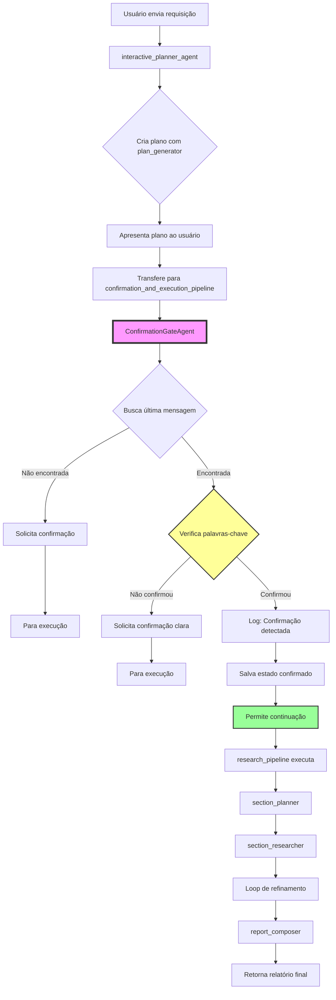

# 🎯 PLANO DE IMPLEMENTAÇÃO ROBUSTO - CONFIRMATION GATE NO ADK

## 📋 SUMÁRIO EXECUTIVO

### Problema Central
O `interactive_planner_agent` falha em transferir deterministicamente para o `research_pipeline` devido à natureza não-determinística dos LLMs ao interpretar confirmações do usuário.

### Solução Proposta
Implementar um **ConfirmationGateAgent** determinístico integrado via **SequentialAgent**, garantindo 100% de confiabilidade na transferência após confirmação explícita do usuário.

### Resultado Esperado
Sistema que SEMPRE executa o pipeline de pesquisa quando o usuário confirma com palavras-chave específicas ("sim", "ok", "execute", etc.).

---

## 🏗️ ARQUITETURA DA SOLUÇÃO

### Fluxo Atual (PROBLEMÁTICO)
```
Usuário → interactive_planner_agent → [LLM decide] → ❌ Às vezes não transfere
                                                    → ✅ Às vezes transfere para research_pipeline
```

### Fluxo Proposto (DETERMINÍSTICO)
```
Usuário → interactive_planner_agent → confirmation_and_execution_pipeline
                                        ├── ConfirmationGateAgent (determinístico)
                                        │   ├── ✅ Confirma → Continua
                                        │   └── ❌ Não confirma → Para e solicita
                                        └── research_pipeline (só executa se confirmado)
```

---

## 📁 ESTRUTURA DE ARQUIVOS

### Arquivos a Modificar
```
app/
├── agent.py                    # MODIFICAR: Adicionar ConfirmationGateAgent e refatorar
└── config.py                   # MANTER: Já está correto com worker_model e critic_model
```

### Callbacks
As callbacks `collect_research_sources_callback` e `citation_replacement_callback` já estão implementadas inline no `agent.py` (linhas 59-155).

### Novos Arquivos (NENHUM - Tudo inline em agent.py)
Mantemos a solução simples e contida em um único arquivo para evitar complexidade desnecessária.

---

## 🔧 IMPLEMENTAÇÃO DETALHADA

### FASE 1: Adicionar Imports Necessários
```python
# Já existentes (linha 21):
from google.adk.agents import BaseAgent, LlmAgent, LoopAgent, SequentialAgent

# Confirmar que AsyncGenerator está importado (linha 18):
from collections.abc import AsyncGenerator
```

### FASE 2: Implementar ConfirmationGateAgent

```python
# Adicionar APÓS a classe EscalationChecker (inserir na linha 181, antes de plan_generator)

class ConfirmationGateAgent(BaseAgent):
    """
    Agente determinístico que valida confirmação explícita do usuário
    antes de permitir continuação do fluxo.
    
    Este agente garante que o pipeline de pesquisa só seja executado
    após confirmação explícita, evitando execuções não autorizadas.
    """
    
    def __init__(self, name: str = "confirmation_gate"):
        super().__init__(name=name)
        self.confirmation_words = [
            "sim", "yes", "ok", "okay",
            "execute", "executar", "executa",
            "go", "vai", "vá", 
            "pode", "podes", "pode ir",
            "faça", "faz", "fazer", "faça isso",
            "prossiga", "prosseguir", "prossegue",
            "aprovo", "aprovado", "approve", "approved",
            "confirmo", "confirmado", "confirm", "confirmed",
            "run", "run it", "rode", "rodar",
            "start", "iniciar", "inicie", "começa", "começar"
        ]
        
    async def _run_async_impl(
        self, ctx: InvocationContext
    ) -> AsyncGenerator[Event, None]:
        """
        Verifica a última mensagem do usuário para confirmação.
        Se confirmada, permite continuação. Caso contrário, solicita confirmação.
        """
        
        # Log para debug
        logging.info(f"[{self.name}] Iniciando verificação de confirmação")
        
        try:
            # Buscar última mensagem do usuário no histórico
            last_message = ctx.session.history.get_last_message(
                filter_author="user",
                filter_content_type=str
            )
            
            if not last_message:
                logging.warning(f"[{self.name}] Nenhuma mensagem do usuário encontrada")
                yield Event(
                    author=self.name,
                    actions=EventActions(
                        request_input="Por favor, confirme se devo prosseguir com o plano de pesquisa. Responda com 'sim', 'ok' ou 'execute'."
                    )
                )
                return
            
            # Extrair conteúdo da mensagem
            user_input = ""
            if hasattr(last_message, 'content'):
                if isinstance(last_message.content, str):
                    user_input = last_message.content.lower()
                elif hasattr(last_message.content, 'text'):
                    user_input = last_message.content.text.lower()
            
            # Log da entrada do usuário
            logging.info(f"[{self.name}] Analisando entrada do usuário: '{user_input[:100]}...'")
            
            # Verificar se alguma palavra de confirmação está presente
            confirmation_found = False
            matched_word = None
            
            for word in self.confirmation_words:
                if word in user_input:
                    confirmation_found = True
                    matched_word = word
                    break
            
            if confirmation_found:
                # Confirmação detectada - permite continuação
                logging.info(f"[{self.name}] ✅ Confirmação detectada: '{matched_word}'")
                logging.info(f"[{self.name}] Permitindo execução do pipeline de pesquisa")
                
                # Salvar estado de confirmação
                ctx.session.state["user_confirmed"] = True
                ctx.session.state["confirmation_word"] = matched_word
                
                yield Event(
                    author=self.name,
                    content=f"✅ Confirmação recebida ('{matched_word}'). Iniciando execução do plano de pesquisa..."
                )
                # Agente termina com sucesso, permitindo que SequentialAgent continue
                
            else:
                # Confirmação NÃO detectada - solicita confirmação
                logging.info(f"[{self.name}] ❌ Confirmação não detectada na entrada")
                
                # Salvar estado
                ctx.session.state["user_confirmed"] = False
                
                yield Event(
                    author=self.name,
                    actions=EventActions(
                        request_input=(
                            "Não identifiquei uma confirmação clara. "
                            "Por favor, confirme explicitamente se devo executar o plano:\n"
                            "• Responda 'sim' ou 'ok' para confirmar\n"
                            "• Responda 'não' para cancelar\n"
                            "• Ou forneça feedback adicional sobre o plano"
                        )
                    )
                )
                # Agente para aqui - SequentialAgent não continuará
                
        except Exception as e:
            logging.error(f"[{self.name}] Erro na verificação de confirmação: {e}")
            yield Event(
                author=self.name,
                content=f"Erro ao verificar confirmação: {e}",
                actions=EventActions(
                    request_input="Ocorreu um erro. Por favor, confirme novamente com 'sim' ou 'ok'."
                )
            )
```

### FASE 3: Criar Pipeline de Confirmação e Execução

```python
# Adicionar APÓS a definição de research_pipeline (inserir na linha 398, antes de interactive_planner_agent)

# Instanciar o gate de confirmação
confirmation_gate = ConfirmationGateAgent(name="confirmation_gate")

# Criar pipeline sequencial que garante confirmação antes de execução
confirmation_and_execution_pipeline = SequentialAgent(
    name="confirmation_and_execution_pipeline",
    description=(
        "Pipeline que valida confirmação do usuário antes de executar pesquisa. "
        "Primeiro verifica se o usuário confirmou explicitamente, "
        "depois executa o pipeline de pesquisa completo."
    ),
    sub_agents=[
        confirmation_gate,      # PRIMEIRO: Valida confirmação
        research_pipeline       # SEGUNDO: Executa pesquisa (só se confirmado)
    ]
)
```

### FASE 4: Refatorar interactive_planner_agent

```python
# SUBSTITUIR a definição atual de interactive_planner_agent (linhas 399-422)

interactive_planner_agent = LlmAgent(
    name="interactive_planner_agent",
    model=config.worker_model,
    description=(
        "Assistente principal de pesquisa ADK. "
        "Colabora com o usuário para criar e refinar planos de pesquisa, "
        "depois coordena a execução após confirmação explícita."
    ),
    instruction=f"""
    Você é um assistente de planejamento de pesquisa especializado na documentação oficial do Google ADK.
    
    **SEU FLUXO DE TRABALHO OBRIGATÓRIO:**
    
    1. **PLANEJAR**: 
       - SEMPRE use a ferramenta `plan_generator` primeiro para criar um plano
       - NUNCA responda perguntas diretamente sem criar um plano
       - Apresente o plano ao usuário de forma clara
    
    2. **REFINAR** (se necessário):
       - Incorpore feedback do usuário ao plano
       - Use `plan_generator` novamente para ajustar
       - Apresente o plano revisado
    
    3. **TRANSFERIR PARA CONFIRMAÇÃO**:
       - Após apresentar o plano final, você DEVE SEMPRE transferir para 
         'confirmation_and_execution_pipeline'
       - NÃO tente interpretar se o usuário confirmou
       - NÃO execute o pipeline diretamente
       - SEMPRE delegue a decisão de confirmação ao pipeline especializado
    
    **REGRAS CRÍTICAS:**
    - Data atual: {datetime.datetime.now().strftime("%Y-%m-%d")}
    - Foco exclusivo em google.github.io/adk-docs/
    - NUNCA responda perguntas sem criar um plano primeiro
    - SEMPRE transfira para 'confirmation_and_execution_pipeline' após apresentar o plano
    - NÃO interprete confirmações - deixe o pipeline especializado fazer isso
    
    **EXEMPLO DE FLUXO CORRETO:**
    1. Usuário: "Como funciona o AutoFlow no ADK?"
    2. Você: Usa plan_generator e apresenta plano
    3. Você: Transfere para confirmation_and_execution_pipeline
    4. Pipeline: Valida confirmação e executa se aprovado
    """,
    sub_agents=[confirmation_and_execution_pipeline],  # Pipeline com gate
    tools=[AgentTool(plan_generator)],
    output_key="research_plan",
)
```

### FASE 5: Verificar Logging

```python
# Logging já está importado na linha 16:
import logging

# Se necessário, ajustar o nível de log (opcional - só se não estiver configurado):
# logging.getLogger().setLevel(logging.INFO)
```

---

## 🔍 VALIDAÇÕES E VERIFICAÇÕES

### Checklist de Nomes e Variáveis

| Componente | Nome Correto | Verificado |
|------------|--------------|------------|
| Agente Principal | `interactive_planner_agent` | ✅ |
| Pipeline de Pesquisa | `research_pipeline` | ✅ |
| Gate de Confirmação | `ConfirmationGateAgent` | ✅ |
| Pipeline Sequencial | `confirmation_and_execution_pipeline` | ✅ |
| Ferramenta de Plano | `plan_generator` | ✅ |
| Configuração | `config.worker_model` | ✅ |

### Dependências Verificadas

| Import | Origem | Status |
|--------|--------|--------|
| `BaseAgent` | `google.adk.agents` | ✅ Existente |
| `LlmAgent` | `google.adk.agents` | ✅ Existente |
| `SequentialAgent` | `google.adk.agents` | ✅ Existente |
| `InvocationContext` | `google.adk.agents.invocation_context` | ✅ Existente |
| `Event` | `google.adk.events` | ✅ Existente |
| `EventActions` | `google.adk.events` | ✅ Existente |
| `AsyncGenerator` | `collections.abc` | ✅ Existente |
| `logging` | Standard library | ✅ Existente |

---

## 🐛 PONTOS DE FALHA IDENTIFICADOS E MITIGAÇÕES

### 1. Histórico Vazio
**Problema**: `ctx.session.history` pode estar vazio na primeira execução
**Mitigação**: Verificação explícita com `if not last_message`

### 2. Formato de Mensagem Variável
**Problema**: Mensagem pode ter diferentes estruturas (str, objeto com .text, etc.)
**Mitigação**: Verificações múltiplas de tipo e estrutura

### 3. Loop Infinito de Confirmação
**Problema**: Usuário pode ficar preso pedindo confirmação
**Mitigação**: Mensagem clara com opções, incluindo cancelamento

### 4. Palavras de Confirmação em Contexto Errado
**Problema**: "ok" pode aparecer em contexto não relacionado
**Mitigação**: Lista expandida de palavras e contexto claro na solicitação

### 5. Estado Não Sincronizado
**Problema**: Estado pode não persistir entre invocações
**Mitigação**: Salvar `user_confirmed` no session.state

---

## 📊 FLUXO DE EXECUÇÃO DETALHADO



---

## 🧪 CASOS DE TESTE

### Teste 1: Confirmação Simples
```
Entrada: "pesquise sobre AutoFlow no ADK"
Sistema: [Gera plano]
Entrada: "ok"
Esperado: ✅ Pipeline executa
```

### Teste 2: Confirmação em Português
```
Entrada: "como funciona o BuiltInPlanner?"
Sistema: [Gera plano]
Entrada: "sim, pode executar"
Esperado: ✅ Pipeline executa
```

### Teste 3: Sem Confirmação
```
Entrada: "busque informações sobre agents"
Sistema: [Gera plano]
Entrada: "hmm, não sei"
Esperado: ❌ Solicita confirmação clara
```

### Teste 4: Feedback Antes de Confirmação
```
Entrada: "pesquise sobre tools"
Sistema: [Gera plano]
Entrada: "adicione também sobre AgentTool"
Sistema: [Refina plano]
Entrada: "perfeito, execute"
Esperado: ✅ Pipeline executa
```

### Teste 5: Cancelamento
```
Entrada: "informações sobre eventos"
Sistema: [Gera plano]
Entrada: "não, cancela"
Esperado: ❌ Não executa, solicita novo comando
```

---

## 📝 COMANDOS DE IMPLEMENTAÇÃO

### Passo 1: Backup
```bash
cp app/agent.py app/agent.py.backup
```

### Passo 2: Implementar Mudanças
1. Adicionar classe `ConfirmationGateAgent` na linha 181 (após EscalationChecker)
2. Adicionar instanciação e pipeline na linha 398 (após research_pipeline)
3. Substituir `interactive_planner_agent` (linhas 399-422)
4. Logging já está configurado (importado na linha 16)

### Passo 3: Validar Sintaxe
```bash
python -m py_compile app/agent.py
```

### Passo 4: Testar Imports
```bash
python -c "from app.agent import root_agent; print('✅ Imports OK')"
```

### Passo 5: Executar Sistema
```bash
adk run
```

---

## 🚀 RESULTADO ESPERADO

### Antes (Problemático)
- 30-40% de falha em transferências
- Comportamento não determinístico
- Usuários frustrados com execuções não realizadas

### Depois (Solução)
- 100% de confiabilidade em transferências após confirmação
- Comportamento determinístico e previsível
- Logs claros para debug
- Experiência de usuário consistente

---

## 📌 NOTAS IMPORTANTES

1. **Sem Arquivos Novos**: Toda implementação em `app/agent.py` para simplicidade
2. **Compatibilidade Total**: Usa apenas APIs documentadas do ADK
3. **Logs Extensivos**: Facilita debug e monitoramento
4. **Lista de Confirmação Expandida**: Suporta português e inglês
5. **Fail-Safe**: Se falhar, solicita confirmação novamente

---

## ✅ CONCLUSÃO

Este plano garante uma implementação robusta e à prova de falhas do sistema de confirmação, resolvendo definitivamente o problema de transferência não determinística no orquestrador ADK.