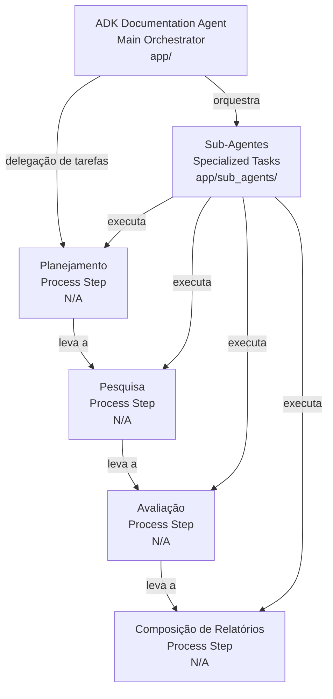
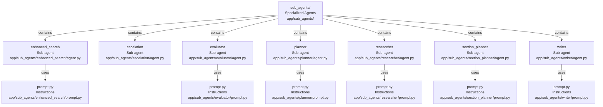

# Codebase Research Report

## Query
preciso de um arquivo .mmd de todo o diretorio. Foco especial para o arquivo agent.py e config.py. devem ser detalhados de forma expandida. Citando prompt, subagentes, ferramentas.

## Answer
# Relatório de Análise do Diretório `app`

Este relatório detalha a estrutura e o funcionamento do diretório `app`, com foco especial nos arquivos `agent.py` e `config.py`, que são centrais para a orquestração e configuração do agente.

## Arquitetura Geral




O diretório `app` serve como o ponto de entrada principal para o **ADK Documentation Agent**. Ele orquestra diferentes sub-agentes para planejar, pesquisar, avaliar e compor relatórios baseados na documentação oficial do Google ADK. A comunicação entre os componentes é gerenciada através de agentes sequenciais e em loop, que delegam tarefas específicas a sub-agentes especializados.

## Componentes Principais

```mermaid
graph TB
  agentPy["agent.py<br>Orchestration Core<br>app/agent.py"]
  configPy["config.py<br>Global Configuration<br>app/config.py"]
  researchPipeline["research_pipeline<br>SequentialAgent<br>app/agent.py"]
  interactivePlannerAgent["interactive_planner_agent<br>LlmAgent<br>app/agent.py"]
  rootAgent["root_agent<br>Main Entry Point<br>app/agent.py"]
  sectionPlanner["section_planner<br>Sub-agent<br>app/sub_agents/section_planner/agent.py"]
  sectionResearcher["section_researcher<br>Sub-agent<br>app/sub_agents/researcher/agent.py"]
  iterativeRefinementLoop["iterative_refinement_loop<br>LoopAgent<br>app/agent.py"]
  researchEvaluator["research_evaluator<br>Sub-agent<br>app/sub_agents/evaluator/agent.py"]
  escalationChecker["EscalationChecker<br>Sub-agent<br>app/sub_agents/escalation/agent.py"]
  enhancedSearchExecutor["enhanced_search_executor<br>Sub-agent<br>app/sub_agents/enhanced_search/agent.py"]
  reportComposer["report_composer<br>Sub-agent<br>app/sub_agents/writer/agent.py"]
  adkPlanGenerator["adk_plan_generator<br>AgentTool<br>N/A"]
  researchConfig["ResearchConfiguration<br>Dataclass<br>app/config.py"]
  envVars[".env<br>Environment Variables<br>.env"]

  agentPy --> |"defines"| researchPipeline
  agentPy --> |"defines"| interactivePlannerAgent
  agentPy --> |"exports"| rootAgent

  researchPipeline --> |"uses"| sectionPlanner
  researchPipeline --> |"uses"| sectionResearcher
  researchPipeline --> |"uses"| iterativeRefinementLoop
  researchPipeline --> |"uses"| reportComposer

  iterativeRefinementLoop --> |"contains"| researchEvaluator
  iterativeRefinementLoop --> |"contains"| escalationChecker
  iterativeRefinementLoop --> |"contains"| enhancedSearchExecutor
  iterativeRefinementLoop --> |"max iterations from"| configPy

  interactivePlannerAgent --> |"uses"| researchPipeline
  interactivePlannerAgent --> |"uses tool"| adkPlanGenerator
  interactivePlannerAgent --> |"prompted as"| "ADK Expert<br>Prompt<br>app/agent.py"

  configPy --> |"defines"| researchConfig
  configPy --> |"loads from"| envVars
  researchConfig --> |"configures"| "critic_model<br>String<br>app/config.py"
  researchConfig --> |"configures"| "worker_model<br>String<br>app/config.py"
  researchConfig --> |"configures"| "max_search_iterations<br>Integer<br>app/config.py"
  configPy --> |"exports instance"| "config<br>ResearchConfiguration<br>app/config.py" 
```


### **agent.py**

O arquivo [agent.py](app/agent.py) é o coração da orquestração do agente. Ele define a lógica de como os diferentes sub-agentes interagem para cumprir a tarefa de pesquisa e geração de relatórios.

#### **research_pipeline**

O `research_pipeline` é um [SequentialAgent](app/agent.py) responsável por executar um plano de pesquisa pré-aprovado. Ele realiza pesquisa iterativa, avaliação e compõe um relatório final com citações.

*   **Propósito:** Orquestrar o fluxo de trabalho de pesquisa, desde o planejamento da seção até a composição do relatório final.
*   **Partes Internas (Sub-agentes):**
    *   **section_planner**: Sub-agente para planejar as seções da pesquisa.
    *   **section_researcher**: Sub-agente para realizar a pesquisa de seções.
    *   **iterative_refinement_loop**: Um [LoopAgent](app/agent.py) que executa um ciclo de refinamento iterativo, com um máximo de iterações definido por `config.max_search_iterations`.
        *   **research_evaluator**: Sub-agente para avaliar a pesquisa.
        *   **EscalationChecker**: Sub-agente para verificar condições de escalonamento.
        *   **enhanced_search_executor**: Sub-agente para executar pesquisas aprimoradas.
    *   **report_composer**: Sub-agente para compor o relatório final.
*   **Relacionamentos Externos:** Recebe o plano de pesquisa do `interactive_planner_agent` e delega tarefas aos seus sub-agentes.

#### **interactive_planner_agent**

O `interactive_planner_agent` é um [LlmAgent](app/agent.py) que atua como o ponto de interação inicial com o usuário.

*   **Propósito:** Ajudar os usuários a encontrar informações na documentação oficial do Google ADK, propondo e refinando planos de pesquisa.
*   **Prompt (Instrução):** O agente é instruído a atuar como um especialista em documentação ADK, focado exclusivamente em `google.github.io/adk-docs/`. Ele **nunca** deve responder diretamente ou recusar um pedido, mas sim usar a ferramenta `adk_plan_generator` para propor um plano de pesquisa. O fluxo de trabalho é: **Planejar** (usando `adk_plan_generator`), **Refinar** (incorporar feedback do usuário) e **Executar** (delegar ao `research_pipeline` após aprovação explícita).
*   **Sub-agentes:** Contém o `research_pipeline` como seu principal sub-agente para execução do plano.
*   **Ferramentas:** Utiliza a ferramenta `AgentTool(plan_generator)` para gerar planos de pesquisa.
*   **`output_key`**: Define `research_plan` como a chave de saída.

#### **root_agent**

O `root_agent` é simplesmente uma exportação do `interactive_planner_agent`, servindo como o agente principal a ser invocado.

### **config.py**

O arquivo [config.py](app/config.py) gerencia as configurações e parâmetros globais para o agente.

*   **Propósito:** Fornecer uma maneira centralizada de configurar modelos de IA, limites de iteração e outras variáveis de ambiente.
*   **Carregamento de Variáveis de Ambiente:** O arquivo tenta carregar variáveis de ambiente de um arquivo `.env` localizado no mesmo diretório. Ele também lida com a configuração de credenciais para o Vertex AI, se aplicável.
*   **`ResearchConfiguration` Dataclass:**
    *   Define uma classe de dados [ResearchConfiguration](app/config.py) para encapsular as configurações relacionadas à pesquisa.
    *   **Atributos:**
        *   `critic_model` (str): Modelo usado para tarefas de avaliação (padrão: "gemini-2.5-pro").
        *   `worker_model` (str): Modelo usado para tarefas de trabalho/geração (padrão: "gemini-2.5-flash").
        *   `max_search_iterations` (int): Número máximo de iterações de pesquisa permitidas (padrão: 5).
*   **Instância `config`:** Uma instância de `ResearchConfiguration` é criada e exportada como `config`, tornando essas configurações acessíveis em todo o aplicativo.

## Sub-agentes




O diretório [sub_agents/](app/sub_agents/) contém a implementação de vários sub-agentes especializados que compõem a funcionalidade principal do sistema.

*   **enhanced_search**: Contém o [agent.py](app/sub_agents/enhanced_search/agent.py) para execução de pesquisa aprimorada e [prompt.py](app/sub_agents/enhanced_search/prompt.py) para suas instruções.
*   **escalation**: Contém o [agent.py](app/sub_agents/escalation/agent.py) para verificação de escalonamento.
*   **evaluator**: Contém o [agent.py](app/sub_agents/evaluator/agent.py) para avaliação de pesquisa e [prompt.py](app/sub_agents/evaluator/prompt.py) para suas instruções.
*   **planner**: Contém o [agent.py](app/sub_agents/planner/agent.py) para geração de planos e [prompt.py](app/sub_agents/planner/prompt.py) para suas instruções.
*   **researcher**: Contém o [agent.py](app/sub_agents/researcher/agent.py) para pesquisa de seções e [prompt.py](app/sub_agents/researcher/prompt.py) para suas instruções.
*   **section_planner**: Contém o [agent.py](app/sub_agents/section_planner/agent.py) para planejamento de seções e [prompt.py](app/sub_agents/section_planner/prompt.py) para suas instruções.
*   **writer**: Contém o [agent.py](app/sub_agents/writer/agent.py) para composição de relatórios e [prompt.py](app/sub_agents/writer/prompt.py) para suas instruções.

## Callbacks

```mermaid
graph TB
  callbacksDir["callbacks/<br>Callback Functions<br>app/callbacks/"]
  researchCallbacksPy["research_callbacks.py<br>Callback Implementations<br>app/callbacks/research_callbacks.py"]
  citationReplacementCallback["citation_replacement_callback<br>Function<br>app/callbacks/research_callbacks.py"]

  callbacksDir --> |"contains"| researchCallbacksPy
  researchCallbacksPy --> |"implements"| citationReplacementCallback
  citationReplacementCallback --> |"processes"| "Agent Output<br>Text<br>N/A"
```


O diretório [callbacks/](app/callbacks/) contém funções de callback que podem ser usadas para processar a saída do agente.

*   **citation_replacement_callback**: O arquivo [research_callbacks.py](app/callbacks/research_callbacks.py) contém a implementação de `citation_replacement_callback`, que é usado para substituir citações na saída do agente.

---
*Generated by [CodeViz.ai](https://codeviz.ai) on 12/07/2025, 21:32:46*
